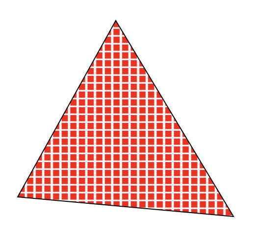

# Creative Coding with WebGL
-----------------------------------------------
# Creative Coding with WebGL


## Hi! I'm Lea Rosema

Junior Frontend Developer

SinnerSchrader

-------------------------------------------------
# What is WebGL?

- it's not a 3D engine
- it's about drawing points, lines, triangles
- it's a low-level API to run code on the GPU

-------------------------------------------------
# Shaders



## Drawing shapes with shaders

The vertex shader computes vertex positions

The fragment Shader handles rasterization


-------------------------------------------------
# GL Shader Language

- GPU-specific language GL Shader language (GLSL)
- It's like C++ with a `void main()`
- ...but with built-in datatypes and functions useful for 2D/3D

----------------------------------------------------
# Vertex shader code

```glsl
attribute vec3 position;

void main() {
  gl_Position = vec4(position, 1.0);
}
```

- via the position attribute, the shader gets data from a buffer
- the shader is run for each position in the position buffer
- the vertex position is set via `gl_Position`

----------------------------------------------------
# Fragment shader code

```glsl
precision highp float;

void main() {
  vec2 p = gl_FragCoord.xy;
  gl_FragColor = vec4(1.0, 0.5, 0, 1.0);
}
```
- The fragment shader is run for each fragment (pixel)
- the pixel coordinate can be read from `gl_FragCoord`
- the output color is set in `gl_FragCoord`

-------------------------------------------------
# Passing Data from JS

- `attribute`: the vertex shader pulls a value from a buffer and stores it in here
- `uniform`: pass variables you set in JS before you execute the shader
- `varying`: pass values from the vertex to the fragment shader


-------------------------------------------------

# Let's try GLSL

## [DEMO: Draw a triangle](https://codepen.io/terabaud/pen/OKVpYV?editors=0010)

-------------------------------------------------
# GL Shader Language

## Datatypes

- primitives (bool, int, float)
- vectors (vec2, vec3, vec4)
- matrices (mat2, mat3, mat4)
- texture data (sampler2D)

---------------------------------------------------
# GL Shader Language
## Cool built-in functions

- `sin`, `cos`, `atan`
- Linear Interpolation (`mix`)
- Vector arithmetics (`+`, `-`, `*`, `/`, `dot`, `cross`, `length`)
- Matrix arithmetics (`+`, `-`, `*`)

----------------------------------------------------
# Running it in JS

## Get the WebGL Context

```js
const gl = canvas.getContext('webgl')
```
...just like initializing a 2D canvas

----------------------------------------------------
# Running it in JS

## Compile the Shaders

```js
const fragmentShader = gl.createShader(gl.FRAGMENT_SHADER);
gl.shaderSource(fragmentShader, fragmentCode);
gl.compileShader();

const vertexShader = gl.createShader(gl.VERTEX_SHADER);
gl.shaderSource(fragmentShader, vertexCode);
gl.compileShader();
```

* like in C++, you have to compile your shaders first.
* and check if it was successful

-----------------------------------------------------
# Running it in JS

## Create the program

```js
const program = gl.createProgram();
program.attachShader(vertexShader);
program.attachShader(fragmentShader);
program.linkProgram();
```

* also like in C++, the two shaders are linked into a `WebGLProgram`.
* you can check if the program is valid via `program.validateProgram()`

------------------------------------------------------
# Running it in JS

## Defining attributes for the vertex shader

```js
const positionLoc = this.gl.getAttribLocation(program, 'position');
this.gl.enableVertexAttribArray(positionLoc);
```

* Activate your attribute via `enableVertexAttribArray`

------------------------------------------------------
# Running it in JS

## Assign a buffer to the attribute

```js
// provide 2D data for a triangle
const data = [-1, -1,  -1,  1,  1, -1];
const buffer = gl.createBuffer();
gl.bindBuffer(gl.ARRAY_BUFFER, buffer);
gl.bufferData(gl.ARRAY_BUFFER,
  new Float32Array(data), gl.STATIC_DRAW);
```

create a buffer and provide data in a `Float32Array`

-----------------------------------------------------
# Running it in JS

## Set the attribute pointer

```js
const recordSize = 2;
const stride = 0; // 0 = advance through the buffer by recordSize * sizeof(data type)
const offset = 0; // the starting point in the buffer
const type = gl.FLOAT; // data type
const normalized = false; // normalize the data (unused for gl.FLOAT)
gl.vertexAttribPointer(positionLoc, recordSize, type, normalized, stride, offset);
```

assign an attribute to a buffer

-----------------------------------------------------
# Running it in JS

## Passing uniform variables

```js
const uTime = gl.getUniformLocation(program, 'time');
gl.uniform1f(loc, tickCount);
```
* Possible types: floats, ints, bools, vectors, matrices
* Pass variables from JavaScript to WebGL
* For example: pass the screen resolution, elapsed time, mouse position

------------------------------------------------------
# Running it in JS

## Draw
```js

createBuffers()
setAttributes();

function animLoop(time = 0) {
  setUniforms();
  gl.drawArrays(gl.TRIANGLES);
  requestAnimationFrame(animLoop);
}

animLoop();
```

------------------------------------------------------
# Useful GLSL functions

```glsl
vec2 coords() {
  float vmin = min(width, height);
  return vec2((gl_FragCoord.x - width * .5) / vmin,
              (gl_FragCoord.y - height * .5) / vmin);
}
```
normalize coords and set (0, 0) to center

------------------------------------------------------
# Useful GLSL functions

```glsl
vec2 rotate(vec2 p, float a) {
  return vec2(p.x * cos(a) - p.y * sin(a),
              p.x * sin(a) + p.y * cos(a));
}
```
rotate a point
------------------------------------------------------
# Useful GLSL functions

```glsl
vec2 repeat(in vec2 p, in vec2 c) {
  return mod(p, c) - 0.5 * c;
}
```
repetition

------------------------------------------------------
# Putting it all together

* [DEMO](https://codepen.io/terabaud/pen/eqNjjY?editors=0010)

------------------------------------------------------
# Thank you :)

## Feedback and Questions

- talk to me afterwards 🙂
- DM me on twitter (`@terabaud`)
- or file an issue in my repo

------------------------------------------------------
# Resources

- [https://github.com/terabaud/hello-webgl/](https://github.com/terabaud/hello-webgl/)
- [https://terabaud.github.io/hello-webgl/talk-webgl/](https://terabaud.github.io/hello-webgl/talk-webgl/)
- [https://github.com/vaneenige/phenomenon/](https://github.com/vaneenige/phenomenon/)
- [https://webglfundamentals.org](https://webglfundamentals.org)
